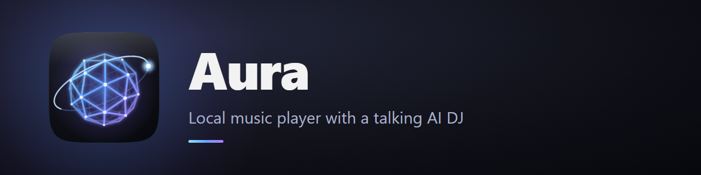

<p align="center">
  
</p>

<p align="center">
  Local desktop music player. Apple Music looks, Spotify brains, a talking AI DJ, and it all runs off your own files.
  <br>
  Nothing leaves your machine except an optional lyrics lookup.
  <br><br>
  <a href="https://github.com/Lucio73-collab/Aura/issues/new?template=bug_report.yml">Report bug</a>
  ·
  <a href="https://github.com/Lucio73-collab/Aura/issues/new?template=feature_request.yml">Request feature</a>
  ·
  <a href="https://github.com/Lucio73-collab/Aura/releases">Releases</a>
</p>

<p align="center">
  <a href="https://github.com/Lucio73-collab/Aura/actions/workflows/ci.yml"></a>
  
  
  
  <a href="LICENSE"></a>
</p>

<!-- Screenshot: save a capture of the main window as docs/assets/screenshot.png, then remove this comment wrapper.
<p align="center">
  
</p>
-->

## Quick start

1. Install Node.js LTS (nodejs.org) if you don't have it
2. Get the code: `git clone https://github.com/Lucio73-collab/Aura.git && cd Aura`
3. `npm install` (first run downloads Electron, takes a minute)
4. `npm start`

Add your music folder when Aura asks (for example `D:\Music\Kanye`). Scanning 400+ files takes a few seconds, then it's cached.

## Build the .exe

```
npm run dist
```

Output lands in `release/`: an `Aura Setup 1.0.0.exe` installer plus a portable exe. On CachyOS use `npm run dist:linux` for an AppImage.

## What's inside

**Playback**
- Crossfade engine: songs blend into each other with equal power fades (0 to 12s, default 5s)
- Automix: watches the outro and starts the blend early when a track goes quiet, DJ style
- Manual skips also fade instead of hard cutting
- Queue, Play next, shuffle, repeat one/all, gapless-ish handoff at 0s fade
- Media keys, Windows media overlay, tray controls, mini player (always on top)

**DJ (the AI part)**
- Endless mix seeded from your play history
- Lines written live by your local Ollama model, spoken by Kokoro TTS
- Music ducks under the voice like real radio
- Aura checks Ollama on boot and launches `ollama serve` automatically if it's down, then warms the model so the first line is instant (toggle in Settings)
- No Ollama or Kokoro? Falls back to built-in lines and Windows voices

**Library and curation**
- Albums and artists auto-built from tags, artwork extracted from files
- Create your own albums and artists for unreleased projects: set release date, type (Album / Single / EP / Mixtape), Unreleased badge, and drag songs in any order
- Drop or paste a custom cover straight onto any album, artist, or playlist page
- Artist pages sort by release date like Spotify, with a Latest Release hero
- Tag editor saves edits inside Aura without touching files; optional "Write tags to MP3" if you want them baked in

**NAS (Navidrome / Subsonic)**
- Settings > NAS: server addresses (home first, then Tailscale), username and password. The password is stored encrypted by Windows, never in plain text
- NAS songs, albums and playlists sit next to your local music, marked with a teal dot, and go through the same crossfade, automix, DJ and search
- The NAS being off never affects local music: its items dim, a status dot shows online/offline, and shuffle and the DJ skip them
- Plays are scrobbled to Navidrome, albums can be downloaded for offline, and an away quality (MP3) can be set for mobile data
- Design notes and test checklist: `docs/nas-source-log.md`

**Extras**
- Liked Songs with heart everywhere
- Synced lyrics view (Apple style): reads embedded tags, .lrc sidecars, or fetches from LRCLIB with one click
- Listening stats: minutes, top songs/artists/albums for week/month/all time
- Smart Shuffle weaves in suggestions marked with a sparkle
- Playlists: drag to reorder, sortable columns (#, Title, Album, Date added, duration)

## First run notes

- `npm install` downloads Electron (~110 MB, one time)
- Kokoro voice model downloads on first DJ use or via Settings (~300 MB, one time, stored in Aura's data folder)
- DJ model: Aura picks a light model from your Ollama list automatically, change it in Settings > DJ

## Keyboard

| Key | Action |
| --- | --- |
| Space | Play / pause |
| Left / Right | Seek 5s |
| Q | Queue panel |
| L | Like current song |
| Esc | Close overlays |

## Data

Everything Aura writes (playlists, likes, plays, custom albums, covers, lyrics, settings) lives in its own data folder under your user profile. Your music files are read only, always, unless you explicitly click Write tags.

Supported formats: mp3, m4a, aac, flac, wav, ogg, opus.

## Tests

```
node scripts/gen-test-audio.js   # one time: tagged WAV fixtures in .test-music/
npm test
```

## Ideas for v1.1

Discord Rich Presence, phone remote over Tailscale, last.fm scrobbling, visualizer.

## Contributing

See [CONTRIBUTING.md](.github/CONTRIBUTING.md). Security issues: [SECURITY.md](SECURITY.md).

## License

Code released under the [MIT License](LICENSE).
